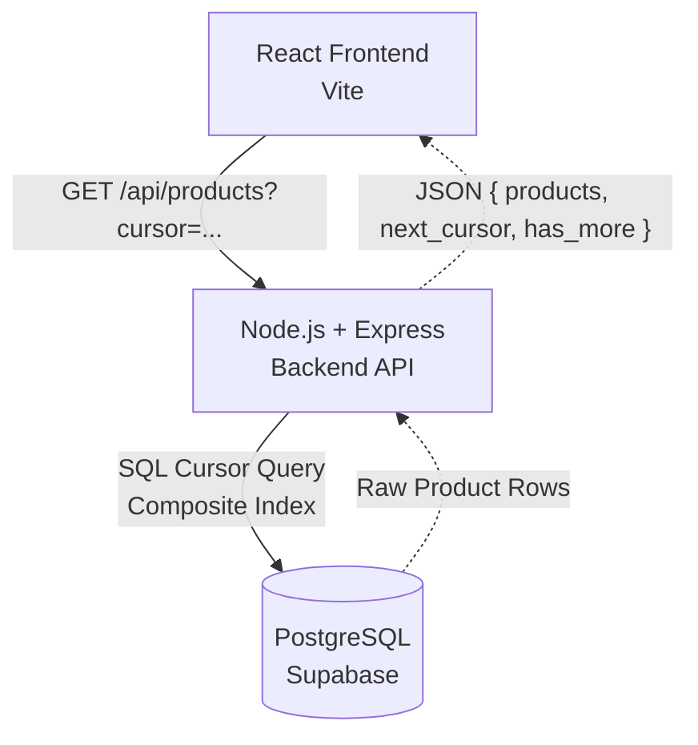

# CodeVector

CodeVector is a sleek, minimal, full-stack web application designed for seamlessly browsing through a massive catalog of ~200,000 products. 

The core technical highlight of this project is the custom-built **cursor (keyset) pagination** engine on the backend. This ensures that navigating deep into the product catalog remains lightning fast and perfectly consistent, avoiding the performance degradation and data duplication issues caused by traditional `OFFSET` pagination.

---

## 🏗️ Architecture

The app is separated into a frontend React client and a backend Node.js API, communicating seamlessly via REST.



### 💻 Tech Stack
- **Frontend:** React, Vite (Minimal black & gold aesthetic)
- **Backend:** Node.js, Express (ES Modules)
- **Database:** PostgreSQL (Hosted on Supabase)
- **Pagination Strategy:** Keyset/Cursor Pagination via `updated_at DESC, id DESC`

---

## 📂 Project Structure

This repository is a monorepo containing both the frontend and backend.

```text
d:\BackendWork
├── backend/          # Node.js API
│   ├── sql/          # DB Schema & Index migrations
│   ├── src/          # Express App, Controllers, Services, Repositories
│   └── .env          # DB Connection Strings (Supabase)
│
└── frontend/         # React Web App
    ├── src/          # React Components, API fetch logic
    └── .env          # Deployed Backend URL Config
```

---

## 🚀 Running Locally

You'll need two terminal windows to run the full stack locally.

**1. Start the Backend:**
```bash
cd backend
npm install
node src/server.js
```
*(Runs on `http://localhost:5000`)*

**2. Start the Frontend:**
```bash
cd frontend
npm install
npm run dev
```
*(Runs on `http://localhost:5173`. API requests are automatically proxied to the backend).*
