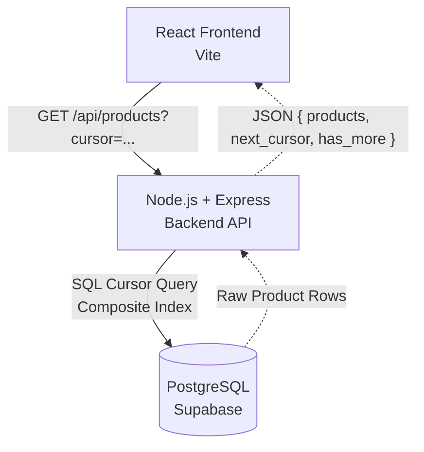

# CodeVector

CodeVector is a sleek, minimal, full-stack web application designed for seamlessly browsing through a massive catalog of ~200,000 products. 

The core technical highlight of this project is the custom-built **cursor (keyset) pagination** engine on the backend. This ensures that navigating deep into the product catalog remains lightning fast and perfectly consistent, avoiding the performance degradation and data duplication issues caused by traditional `OFFSET` pagination.

---

## 🏗️ Architecture

The app is separated into a frontend React client and a backend Node.js API, communicating seamlessly via REST.



### 💻 Tech Stack
- **Frontend:** React, Vite (Minimal black & gold aesthetic)
- **Backend:** Node.js, Express (ES Modules)
- **Database:** PostgreSQL (Hosted on Supabase)
- **Pagination Strategy:** Keyset/Cursor Pagination via `updated_at DESC, id DESC`

---

## 🧠 Design Decisions

I made the following design decisions. I have explained my reasoning here:

### 1. Cursor Pagination over OFFSET
I used a cursor (last seen timestamp + ID) instead of page numbers. 
**Why:** Traditional `OFFSET` gets slower the deeper you paginate and causes duplicated/skipped products when new data is added. Cursors act as an exact bookmark, keeping pagination instantly fast regardless of depth.

### 2. Deterministic Ordering (`updated_at + id`)
I sort by `updated_at DESC, id DESC`.
**Why:** Sorting only by time is risky because multiple products can have the exact same timestamp. Adding the unique `id` as a tiebreaker guarantees every product stays in a strict, predictable order.

### 3. Composite Indexing
I created a single database index covering `(category, updated_at DESC, id DESC)`.
**Why:** This exactly mirrors my SQL query. It allows PostgreSQL to filter by category and instantly return pre-sorted rows, entirely skipping expensive manual sorting steps.

### 4. `has_more` without `COUNT(*)`
The database query limits results to 21 items, even though the page size is 20.
**Why:** Counting all 200,000 rows just to see if a next page exists is slow. If the database returns 21 items, I immediately know there is a next page (`has_more: true`), and I simply trim the 21st item before sending it to the frontend.

---

## 📂 Project Structure

This repository is a monorepo containing both the frontend and backend.

```text
d:\BackendWork
├── backend/          # Node.js API
│   ├── sql/          # DB Schema & Index migrations
│   ├── src/          # Express App, Controllers, Services, Repositories
│   └── .env          # DB Connection Strings (Supabase)
│
└── frontend/         # React Web App
    ├── src/          # React Components, API fetch logic
    └── .env          # Deployed Backend URL Config
```

---

## 🚀 Running Locally

You'll need two terminal windows to run the full stack locally.

**1. Start the Backend:**
```bash
cd backend
npm install
node src/server.js
```
*(Runs on `http://localhost:5000`)*

**2. Start the Frontend:**
```bash
cd frontend
npm install
npm run dev
```
*(Runs on `http://localhost:5173`. API requests are automatically proxied to the backend).*
